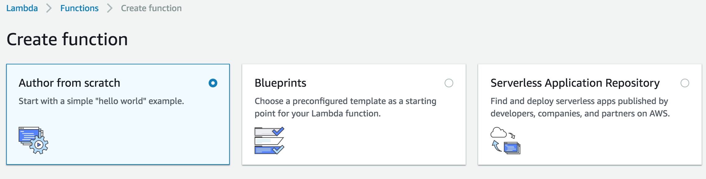
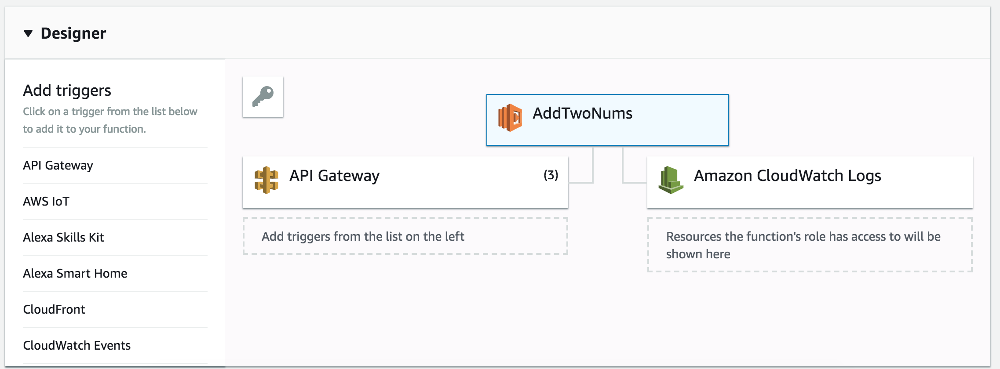
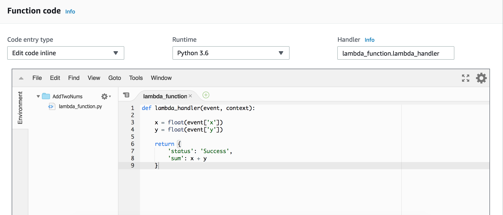
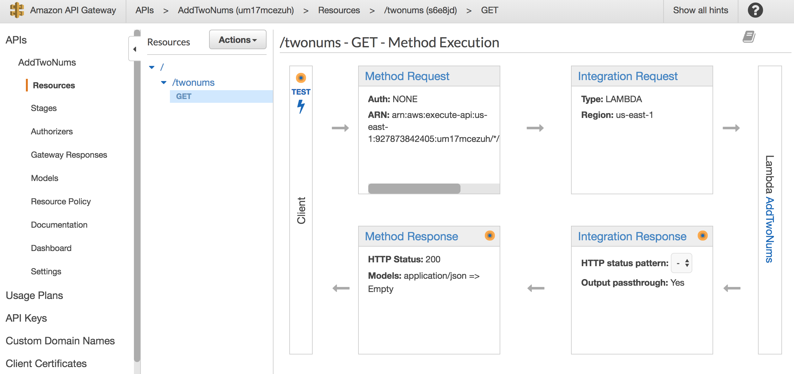
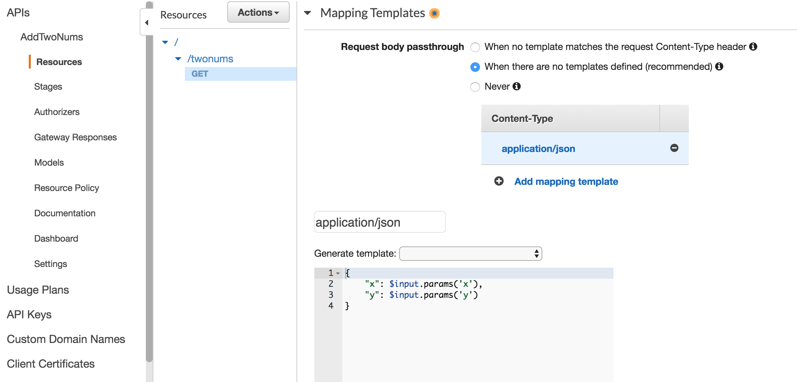
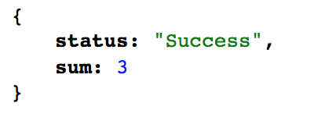

# Building an API by AWS API Gateway and Lambda

AWS API Gateway allows you to connect mobile and web applications with business logic hosted on AWS Lambda. With API Gateway, you could create and operate APIs for backend services. In this example, I'll build a API for the querying of the sum of two numbers.

## Create a Lambda Function
1. Choose runtime. To start a simple example, choose 'Aurhor from scratch', then give a name to the function and choose python 3.6 as rutime.

2. Choose role. The role defines the permissions of the function and I choose the existing one.
3. Add triggers. Add API Gateway as Trigger and when the function part is done, turn to the gateway.

4. Function code. Here we cold edit codes inline.

__Note__: The definition of the lambda_function should be 'lambda_handler(event, context)'.

5. Test codes. Save and test codes at the meantime.

## Create API
1. Choose the service of API Gateway and create a new API.
2. Choose 'Actions' then create resource. Here the Resource Name is 'twonums'.
3. Choose 'Actions' then create method as 'GET', and connect it with the Lambda function created before.

4. For this /nyc-GET Method, choose `Integration Request` --> `Body Mapping Templates`, add a mapping template in it.

5. Choose 'Actions' then deploy API. Now the API is ready for querying. 
      
      https://um17mcezuh.execute-api.us-east-1.amazonaws.com/Add
      
 ## Test
 ### Query the sum of x and y, when x =1 and y = 2.
 twonums?x=1&y=2
     
      https://um17mcezuh.execute-api.us-east-1.amazonaws.com/Add/twonums?x=1&y=2
  
  
 
